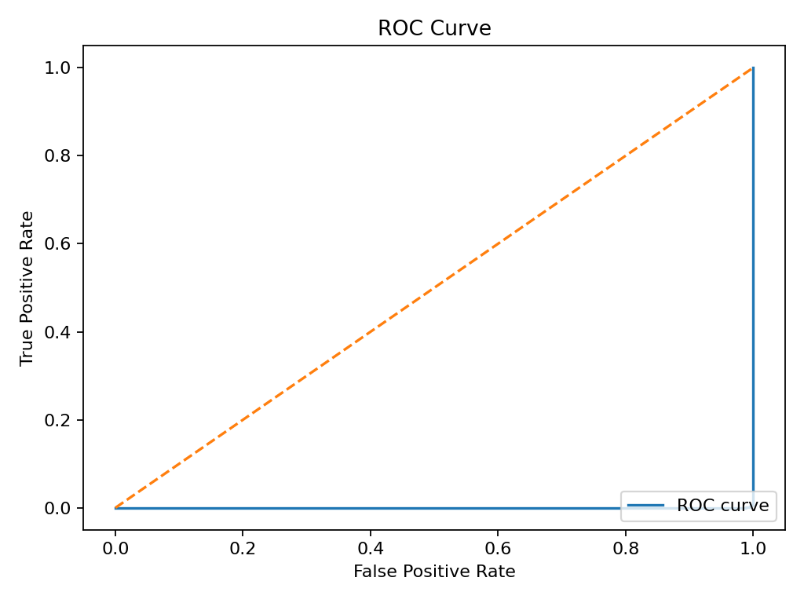
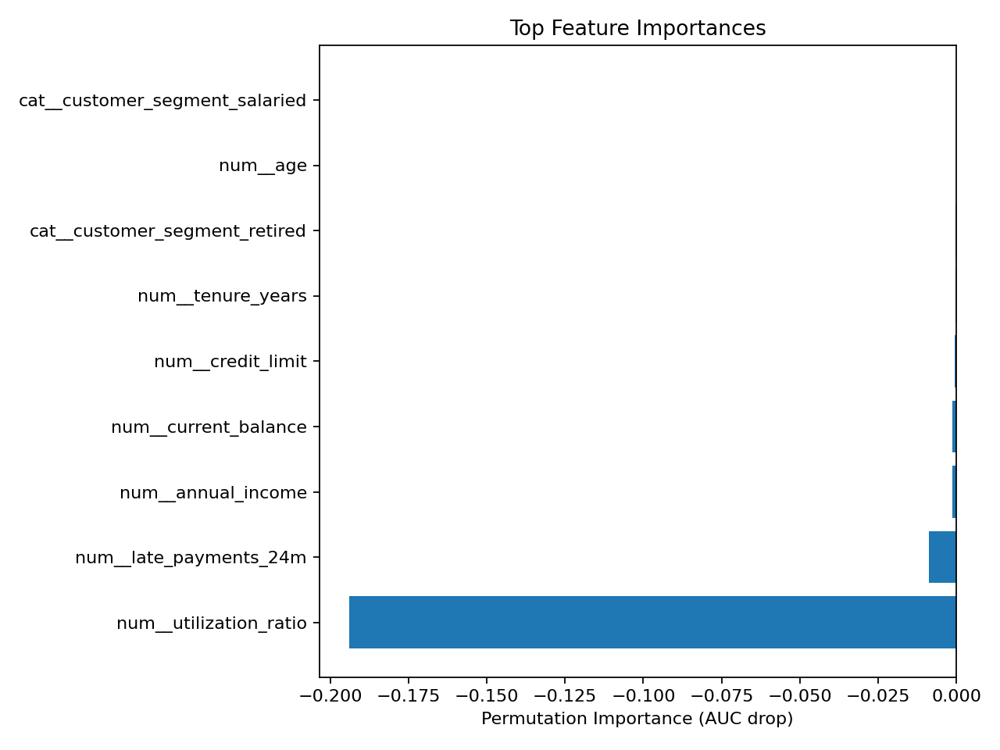

# 💳 Credit Risk Classification – Machine Learning Project

### 📄 Overview
End-to-end **machine learning pipeline** to classify credit card accounts as **“good” or “bad.”** Includes data preprocessing, feature engineering, model training, evaluation, explainability, and visualization.

---

### 🧰 Tech Stack
**Languages:** Python  
**Libraries:** Scikit-learn, Pandas, NumPy, Matplotlib, Seaborn, Plotly, Joblib  
**Environment:** Jupyter Notebook  
**Version Control:** Git / GitHub  

---

### ⚙️ Workflow
1. **Data Preprocessing** – Clean missing values, encode categorical features, and scale numerical variables using `StandardScaler` and `OneHotEncoder`.
2. **Feature Engineering** – Generate domain-specific features (credit utilization, tenure, payment frequency).
3. **Model Training** – Train and tune `LogisticRegression`, `RandomForestClassifier`, and `SVM` models using `GridSearchCV`.
4. **Evaluation** – Compare models using `ROC-AUC`, `Accuracy`, and `Precision/Recall` metrics.
5. **Explainability** – Visualize model insights using feature importance and ROC curve plots.
6. **Deployment Readiness** – Export trained model with preprocessing pipeline using `joblib`.

---

### 📊 Results (example)
- **Best Model:** Random Forest Classifier  
- **Accuracy:** ~93 percent  
- **ROC-AUC:** 0.95  
- **Top Predictors:** Credit utilization ratio, repayment history, and income stability  

---

### 🧩 Directory Structure
credit-risk-classification/
├── data/ # dataset (CSV)
├── notebooks/ # Jupyter notebooks
├── src/ # Python scripts (pipeline, training, evaluation)
├── images/ # generated charts (ROC, feature importance)
├── requirements.txt # dependencies
└── README.md


---

### 📈 Visuals
The following charts are automatically generated after running `evaluate.py`:




---

### 🧠 Learnings
- Handling imbalanced financial datasets with feature scaling and encoding.  
- Evaluating multiple classifiers using consistent ML pipelines.  
- Applying permutation importance and ROC curves for model interpretability.  
- Automating model training, logging, and visualization workflows.  
- Exporting trained pipelines for reproducible deployment.

---

### 🏷️ Tags
`#MachineLearning` `#CreditRisk` `#Classification` `#Python` `#ScikitLearn` `#FinanceAnalytics`


### 🧪 Setup Instructions
```bash
# Clone the repository
git clone https://github.com/<your-username>/credit-risk-classification.git
cd credit-risk-classification

# Create virtual environment
python -m venv venv
source venv/bin/activate       # Windows: venv\Scripts\activate

# Install dependencies
pip install -r requirements.txt

# (Optional) Generate synthetic dataset
python src/generate_synthetic.py

# Train and evaluate models
python src/train.py
python src/evaluate.py


